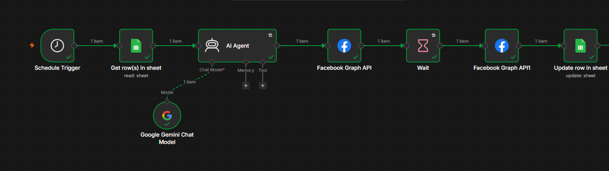
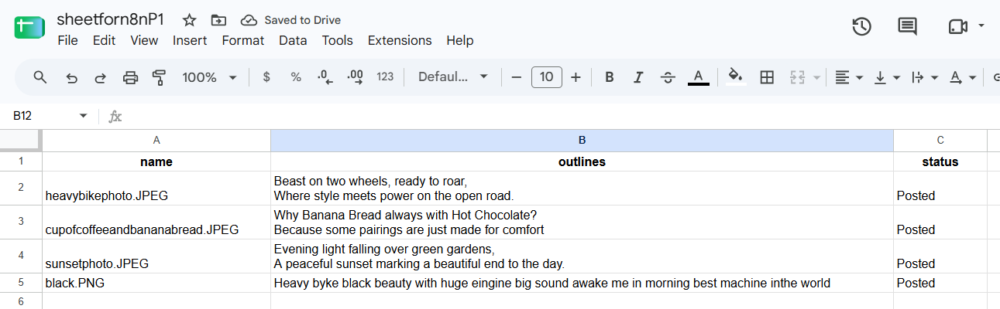

# Instagram Auto-Posting with n8n

Automated Instagram posting using n8n, Google Sheets, Cloudinary, Google Gemini and the Meta Graph API.

## How it works
1. Schedule Trigger starts the workflow
2. Reads the next row from Google Sheets
3. Google Gemini writes the caption from the outline
4. Meta Graph API creates the media container
5. Waits 60 seconds for Instagram to process the media
6. Meta Graph API publishes the post
7. Google Sheet status is updated to "Posted"

## Tools used
n8n, Google Sheets, Cloudinary, Google Gemini, Meta Graph API

## Setup
1. Import `workflow/instagram-automation.json` into n8n (Menu → Import from File)
2. Add your own credentials (Google Sheets, Gemini, Facebook Graph API)
3. Create a sheet with columns: name, outlines, status
4. Replace the placeholder IDs with your own

## Screenshots

